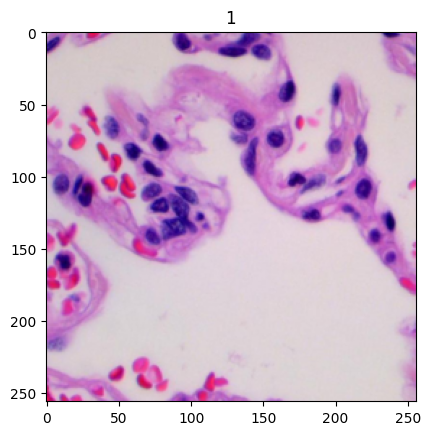

<!--
 * @Author: hibana2077 hibana2077@gmail.com
 * @Date: 2024-05-29 00:18:07
 * @LastEditors: hibana2077 hibana2077@gmail.com
 * @LastEditTime: 2024-06-10 10:09:24
 * @FilePath: \Lung-and-Colon-Cancer-Histopathological-Images-Challenge\README.md
 * @Description: 这是默认设置,请设置`customMade`, 打开koroFileHeader查看配置 进行设置: https://github.com/OBKoro1/koro1FileHeader/wiki/%E9%85%8D%E7%BD%AE
-->
# Lung and Colon Cancer Histopathological Images Challenge

     

## Introduction

     

This repository contains the code for the Lung and Colon Cancer Histopathological Images Challenge. The challenge is to classify the images of lung and colon cancer histopathology slides into 4 classes: `lung adenocarcinoma`, `lung squamous cell carcinoma`, `colon adenocarcinoma`, and `normal`. The dataset is provided by the [Cancer Imaging Archive](https://www.cancerimagingarchive.net/).